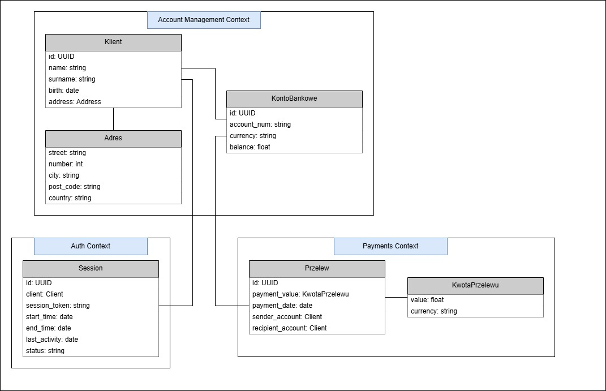

# TBO - Lab1
#### Mateusz Szostak

## Opis zadania
Celem zadania było zamodelowanie bezpiecznej aplikacji bankowej (fragmentu) wykorzystując zasady Domain Driven Design. W rozwiązaniu należało:
 - zdefiniować przykładowe konteksty aplikacji,
 - zmodelować agregaty i encje
 - zdefiniować przyjęte założenia

## Definicja kontekstów

W proponowanym rozwiązaniu zdefiniowano trzy przykładowe konteksty:
 - Zarządzanie kontem (Account Management), czyli kontekst określajacy obsługę konta klienta oraz obsługę danych klienta
 - Przelewy/Płatności (Payments), czyli kontekst odpowiedzialny za realizacje przelewów/płatności
 - Uwirzytelnianie (Auth), czyli kontekst odpowiedzialny za uwierzytelnianie klietna oraz za sesję klienta

## Model
.

## Opis modelu

Agregaty, encje oraz obiekty wartości wraz z ich atrybutami przedstawione zostały poniżej.

### Kontekst: Account Management
 - Agregat: KontoBankowe
    - Atrybuty: id, account_num, currency, balance
 - Encja: Klient
    - Atrybuty: id, name, surname, birth, address
 - Obiekt wartości: Adress
    - Atrybuty: street, number, city, post_code, country

### Kontekst: Payments
 - Agregat: Payment
    - Atrybuty: id, payment_value, payment_date, sender_account, recipient_account
 - Obiekt wartości: KwotaPrzelewu
    - Atrybuty: value, currency

### Kontekst: Auth
 - Agregat: Session
    - Atrybuty: id, client, session_token, start_time, end_time, last_activity, status

## Założenia i ograniczenia

Dla wszystkich klas można przyjąć jedno ogólne założenie: atrybut id (tam gdzie występuje) musi być unikalne. Pozostałe zalożenia zostały przedstawione poniżej:

 - KontoBankowe
    - account_num musi być zgodny z formatem IBAN oraz musi być unikalny
    - currency musi być zgodne z określoną listą obsługiwanych walut
 - Klient
    - wartości name oraz surname muszą mieć ograniczoną ilość znaków oraz nie mogą być puste
 - Adres
    - Żadna z wartości nie może być pusta
    - Wartości muszą mieć ograniczoną ilość możliwych znaków
    - Wartość post_code musi być odpowiednim formacie (np. XX-XXX)
 - Payment
    - sender_account oraz recipent_account nie mogą mieć tej samej wartości
 - KwotaPrzelewu
    - value nie może być ujemna
    - currency musi być zgodne z określoną listą obsługiwanych walut 
 - Session
    - session_token powinien być unikalny
    - start_time oraz last_activity nie mogą być datą z przyszłości
